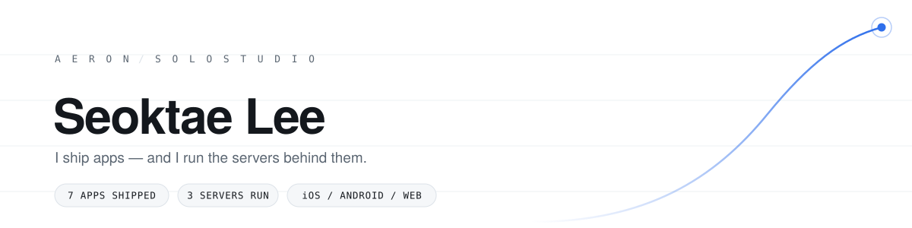
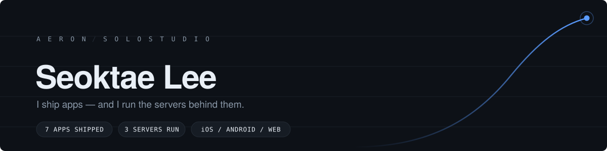
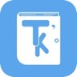

| **Backend Developer** |

🛠️ 앱을 만들고 그 뒤의 서버·인프라까지 직접 운영해온, **백엔드를 지향하는 개발자**입니다.

 

## ☁ Information

> **Info**

- **이름** : 이석태 (Seoktae Lee)
- **소속** : 한국외국어대학교 정보통신공학과
- **Location** : Yongin, South Korea

> **Contact**

 

## ☁ Products

기획부터 서버·배포·운영까지 **1인**으로 만들어 실제로 출시한 서비스입니다.

| | Product | Highlight | Link |
|:--:|:--|:--|:--|
|  | **티처스노크** 임용고시 학습 관리 · iOS | 카카오 로그인이 **예측 가능한 비밀번호**로 계정을 만들던 구조를 Firebase Custom Token 방식으로 전환하고, 기존 사용자 UID를 **무중단 마이그레이션**했습니다. |  |
|  | **떠나** 자동 브이로그 · 여행 코스 · iOS · Android · Web | **REST API 56개**를 실서버 3대에서 직접 운영하고, Socket.IO 실시간 채팅·위치 공유와 **APNs · FCM 2경로** 푸시를 구축했습니다. |    |
|  | **헬로** 안부 인사 · 리워드 · 토스 미니앱 | Express · TypeScript 백엔드에 **JWT 인증**과 토스 로그인을 연동했습니다. 앱 설치 없이 토스에서 바로 실행됩니다. |  |

 

## ☁ Dev Stacks

> **Mobile**

   

> **Back-end**

     

> **Database**

 

> **Web**

  

> **Infra & Ops**

   

 

## ☁ Development Tools

     

 

## ☁ Experience

- **2022** · 정보통신공학과 AdvICE 학회 Java 프로그래밍 2팀
- **2025** · 정보통신공학과 AdvICE 학회 C언어
- **2025** · 사이드 프로젝트 — **티처스노크** 임용고시 학습 관리 앱 (iOS)
- **2026** · 사이드 프로젝트 — **떠나** 자동 브이로그 · 여행 코스 앱 (iOS · Android · Web)
- **2026** · 사이드 프로젝트 — **헬로** 토스 미니앱
- **2026** · KISA 위치정보 클라우드 지원사업 선정 — 떠나 서버 인프라 지원

 

## ☁ Currently

- **Java · Spring Boot 이관** — 운영 중인 백엔드를 스트랭글러 패턴으로 옮기는 중입니다
- **[cs-study](https://github.com/seoktae-lee/cs-study)** — 컴퓨터구조 · 알고리즘 · 네트워크 · 데이터베이스 · 운영체제
- **알고리즘** — 자료구조부터 그래프까지 순서대로
